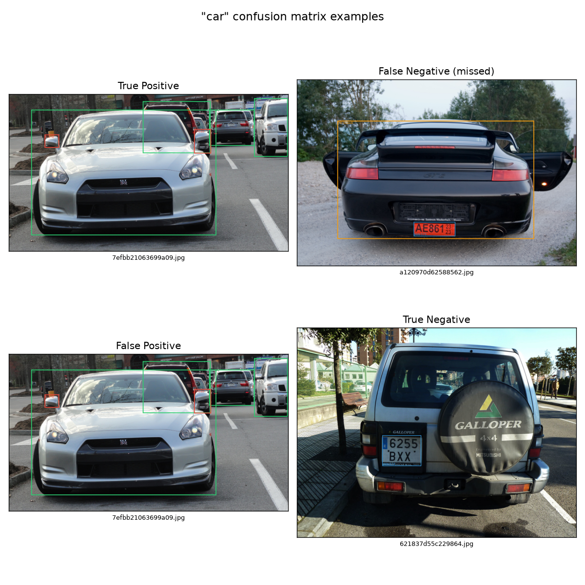
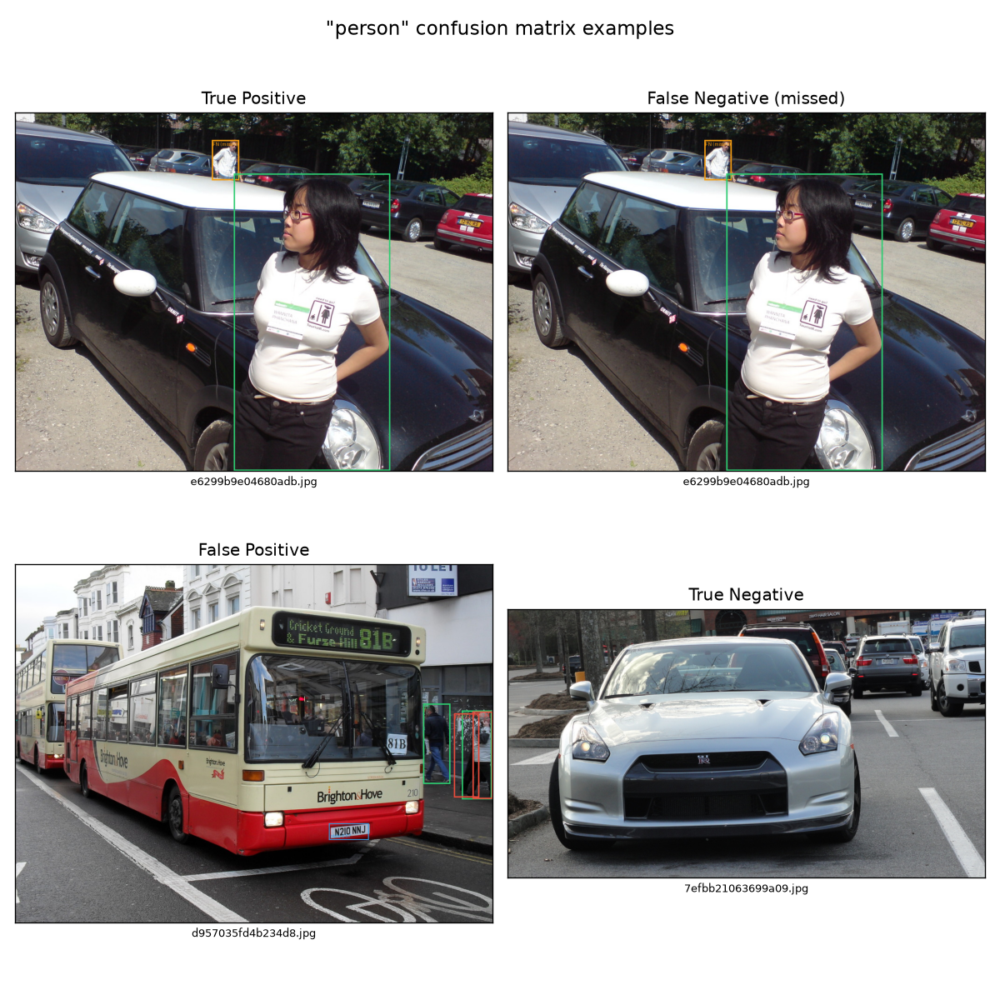
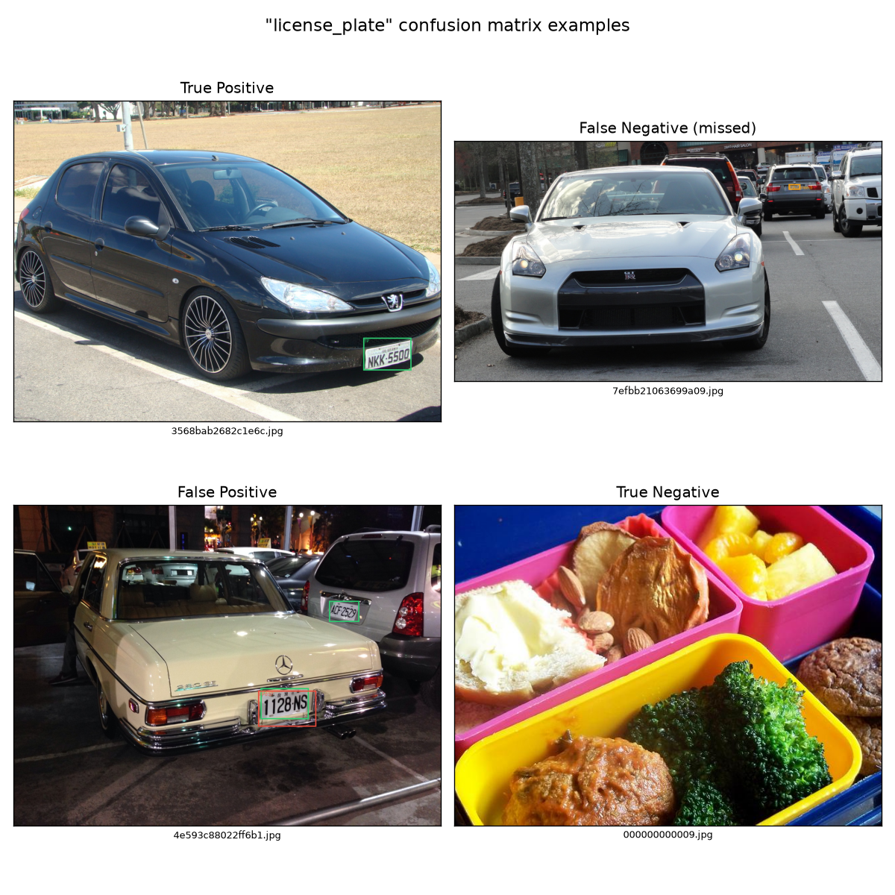

# License plate fine-tuning: implementation report

Companion to [`PLAN-realtime-license-plate-detection.md`](./PLAN-realtime-license-plate-detection.md), which this implements. That doc is the forward-looking plan; this one is a record of what actually happened building it — mainly three rounds of a subtle bug class that weight-tensor comparison alone didn't catch, and how each was found.

## TL;DR

Fine-tuned `yolo12n` to add `license_plate` as an 81st class, warm-started from `car`'s pretrained weights, on the 724-image dataset from `data/license_plates/`. The goal throughout: add the new class with **zero regression** to the other 80 COCO classes — this app already works for person/car/etc. detection, and shipping a plate detector that quietly breaks those would be a bad trade.

That goal turned out to be considerably harder to actually verify than to state. Four separate bugs, each looking fixed after the previous verification pass, were found only by going one level deeper each time — first by comparing more weight tensors, then by running real inference and checking the output made sense, finally by actually exercising an interrupt-and-resume cycle instead of only the happy path. The training script (`training/finetune_license_plate.py`) contains the accumulated fix for all four; this report explains why each layer of protection was necessary.

## Background: why this needed custom code at all

Ultralytics supports changing `nc` (class count) when fine-tuning out of the box — feed it a `.pt` checkpoint and a dataset with a different class count, and it reconstructs the model and does its own best-effort weight transfer. The problem: "best effort" isn't "guaranteed," and this task's dataset only labels license plates, not the 80 other object types that are almost certainly also present in the same 724 images (there's a car in nearly every plate photo). Any classification-branch weights that aren't explicitly protected will drift toward "unlabeled cars are false positives" over the course of training, since that's exactly what the loss function sees.

The plan called for: warm-start the new class from `car`'s weights, freeze everything except the classification head, and explicitly guard the old 80 classes' weights during training. The rest of this report is about the gap between "guard the classification head" as a sentence and actually doing it correctly against a real, moderately complex model architecture (YOLOv12's attention-based backbone).

## Bug 1: only the final classification layer was protected

**Assumption going in:** each detection scale's classification branch (`cv3`) ends in one `Conv2d` that maps hidden features directly to the 80 (now 81) per-class scores. Protect that layer's weights for indices 0–79, and the other 80 classes are safe.

**Reality:** ultralytics' `Detect` head sizes `cv3`'s channel width as a function of `nc` throughout the *entire* branch, not just the output layer. When `.train()` reconstructs the model for a new `nc`, it rebuilds all of `cv3`'s internal layers at the new width — only the final layer gets ultralytics' own by-class-name weight remapping; the layers before it are effectively reinitialized.

**How it was caught:** after a full 50-epoch run with only the final layer hooked, a direct tensor comparison (`torch.equal`) between the pretrained checkpoint's classification weights and the trained checkpoint's, for the *intermediate* layers this time, showed a max absolute difference of 0.22 — not floating-point noise, real drift.

**Fix:** protect all layers within `cv3` that ultralytics' architecture couples to `nc`, not just the last one.

## Bug 2: the fix in Bug 1 still only found 3 of 5 actual layers

Having learned to look beyond the final layer, the fix protected what appeared to be all of `cv3`'s structure: two intermediate `Conv`+`BatchNorm` blocks plus the final conv. Re-verified byte-exact preservation across all of those — every check passed.

**Reality:** each `cv3` branch actually has 5 conv layers, not 3. The "two intermediate blocks" each contain a `DWConv` (depthwise) *and* a `Conv` (regular) — the fix had only found and protected the `Conv` half of each pair, silently skipping both `DWConv`s.

**How it was caught:** not by more tensor comparison — the tensor comparisons for the layers that *were* being checked all passed cleanly, which is precisely what made this dangerous. It surfaced by exporting the trained model to ONNX and running actual inference on a test image: **every single detection above threshold was `license_plate`**, regardless of what was in the image. That's the signature of a corrupted shared feature pathway upstream of otherwise-correctly-frozen final weights, not a subtly-wrong result.

This was the point in the process where the verification methodology itself had to change: comparing the specific tensors the code happens to touch will always look correct, because those are exactly the tensors that got hand-verified. The real question is whether the *model's behavior* regressed, which requires running it.

**Fix:** mapped the complete 5-layer structure of each `cv3` branch precisely (via direct module inspection, not assumption) and classified each layer by how its `nc`-dependence needs to be handled:
- One layer (`DWConv`, fixed 64 channels, not `nc`-dependent) — full freeze, no partial protection needed.
- One layer (`DWConv`, depthwise, `nc`-dependent) — per-channel copy; depthwise convs don't mix channels, so there's no cross-channel leakage to worry about.
- Three layers (regular `Conv`s, `nc`-dependent output, sometimes also `nc`-dependent input since they receive another `nc`-width layer's output) — per-row copy, *plus* explicitly zeroing the new input column(s) for old classes' rows, since a straight copy would leave that column at an arbitrary initialized value and let the new class's pathway leak into old classes' output even with their "own" weights intact.

Re-verified: all 5 layers × 3 detection scales byte-exact preserved after a full training run this time.

## Bug 3: a bug in ultralytics itself, unrelated to any of the above

With all of `cv3` correctly protected and verified, the same "run real inference, don't just trust tensors" check was applied again as standard practice. **Still broken** — `car` on a test image scored ~0.07, when the untouched original model scores ~0.38 on the same image via the same code path. Something was still off, and this time it wasn't in `cv3` at all.

**Root cause:** the currently-installed ultralytics version reconstructs two backbone attention blocks (`A2C2f`, modules 6 and 8 in `yolo12n`'s architecture) with `bias=False` on their positional-encoding convs (`attn.pe.conv`) — but the actual released `yolo12n.pt` checkpoint has `bias=True` there, with real trained values. This has **nothing to do with changing `nc`** — it reproduces identically reconstructing at `nc=80` (i.e. no class change at all). It's a version-skew bug: whatever ultralytics version originally exported `yolo12n.pt` defined that layer differently than the version installed here (`8.4.104`).

**Why it mattered more than "8 missing small numbers" suggests:** YOLOv12's `A2C2f` blocks lean heavily on attention, and even small positional-encoding bias differences shift attention patterns more than an equivalent perturbation would in a non-attention architecture. Confirmed via isolated testing: restoring exactly those 8 bias values (nothing else touched) took old-class output from ~5x-degraded back to byte-identical with the untouched pretrained model.

**A further wrinkle:** the fix, applied live during training (`on_train_start`), didn't survive ultralytics' own end-of-training checkpoint-saving process — the saved `best.pt` had the bug again. (Likely because checkpoint-stripping re-derives the module structure rather than deep-copying the live training-time model as-is.) Had to be re-applied as an explicit post-processing step on the final saved artifact, not just during training.

**Scope note:** this fix is specific to `yolo12n`'s architecture (the `A2C2f` attention blocks at those two module indices). It would need to be re-derived (or may not apply at all) for a different base model — see the "open question" in the plan doc about `yolo12n` vs `yolov7-tiny` as the fine-tuning target.

## Bug 4: the Bug 3 fix broke resuming a training run

Bug 3's fix (dynamically creating a `torch.nn.Parameter` on the live model inside the `on_train_start` callback) worked for a single uninterrupted training run. It did not survive being interrupted and resumed.

**Symptom:** resuming from a checkpoint crashed inside ultralytics' own "fitness collapse" auto-recovery mechanism (`BaseTrainer._handle_nan_recovery`, which fires whenever validation fitness drops to exactly 0 after having been positive — not resume-specific, it can fire during *any* run) with `RuntimeError: Missing key(s) in state_dict ... attn.pe.conv.bias`.

**Root cause:** ultralytics creates `ModelEMA` (an exponential-moving-average shadow copy of the model, used for the actual saved/validated weights) *before* `on_train_start` fires. My dynamically-added bias parameter existed only on the live training model, not on that EMA shadow copy — so every checkpoint's saved EMA state was missing the key from the start. Any code path that later reloads an EMA snapshot into the live model (recovery, or a plain resume) hits a state_dict mismatch. This made resuming actively unsafe, not just untested.

**Fix — this time, structural, not post-hoc:** monkeypatch `ultralytics.nn.modules.block.AAttn.__init__` itself, at module import time, so that *every* `AAttn` instance constructed for the rest of the process — the initial model, EMA's deepcopy, recovery's reconstructions, all of them — gets the bias parameter as a normal part of its architecture, not something bolted on after the fact. Verified this also makes the earlier post-hoc fix mostly redundant: loading the original `yolo12n.pt` checkpoint now populates the bias with its real trained values automatically, via ordinary `state_dict` loading, no special-casing needed. Kept the old post-hoc restore function as a defense-in-depth check (it now reports "restored 0" in the normal case — confirmation the structural fix is doing its job).

**Verified:** ran an actual interrupt-and-resume cycle (killed the process mid-epoch, resumed via ultralytics' own `resume=True`) end to end with no crash, then re-ran the full weight-preservation check on the result — all classes still byte-exact.

## Data-centric follow-up: pseudo-labeling instead of (or alongside) pure weight-freezing

Everything above defends against forgetting purely through architecture engineering (freeze this, guard that). There's a simpler, complementary fix for *why* forgetting was a risk in the first place: the dataset only labels license plates, even though nearly every photo also has a car, often a person. The loss function has no way to know those are real, undetected objects rather than false positives — it just sees "the model predicted a box here and the label doesn't say anything should be there."

Added `training/pseudo_label_plates.py`: runs the (untouched, pretrained) `yolo12n.pt` over all 724 images and merges its detections (conf ≥ 0.25) into each image's label file, alongside the original manually-annotated `license_plate` box. Result: 1766 additional labels across the 724 images (dominated by `car`: 1275, `person`: 211, `truck`: 182, plus smaller counts of bus/motorcycle/etc., and some plausible noise from the nano model at low counts — suitcase, keyboard, chair — expected for pseudo-labeling, not hand-verified).

This is standard-issue noisy pseudo-labeling — the labeler's own mistakes become label noise in the training set — not a substitute for real ground truth. But it directly addresses the mechanism that made the elaborate freezing necessary in the first place, and is worth treating as the primary defense going forward, with the weight-freezing as a secondary safety net rather than the only line of defense.

The original plate-only annotations are preserved untouched in `data/license_plates/labels_plates_only/` (the pseudo-labeling script always regenerates `labels/` from that reference plus a fresh inference pass, rather than reading its own prior output, so re-running it is idempotent, not additive).

## Verification methodology (what actually caught these)

In order of how each bug was found, cheapest/weakest to most expensive/strongest:

1. **Tensor equality on the specific weights the code touches.** Necessary but insufficient — passed even when Bug 2 was fully live, because it only checked what it was told to check.
2. **Tensor equality on a wider net of weights** (once suspicion is raised that something's missing). Caught Bug 1.
3. **Running real inference on a real image and sanity-checking the output.** Caught Bugs 2 and 3, both of which had every narrow tensor check passing.
4. **Actually exercising the operational path (interrupt + resume), not just the happy path.** Caught Bug 4, which no amount of single-run testing would have surfaced.

The practical rule this suggests for similar work: never trust "the weights I checked are correct" as equivalent to "the model works," and never trust "the happy path works" as equivalent to "the operational procedure (interrupt, resume, recover) works."

`training/review_confusion_matrix.py` generated per-class confusion grids
(predicted vs. actual, sampled from misclassified examples) for the three
categories this fine-tune touches:

## Current status

Architecture and resume are now verified robust (see Bugs 1-4 above), and the dataset has been pseudo-labeled. No trained model has been produced/exported yet as of this report — training was intentionally paused mid-run to let these fixes land first; the next actual training run is expected to happen on taco (more compute available there) rather than continuing locally. See "Next steps" below.

## Next steps

Roughly in priority order:

1. **Run the actual training on taco.** Nothing here has run for a full 50 epochs since the architecture/resume fixes landed — everything above is validated on short (2-8 epoch) smoke tests. `training/finetune_license_plate.py` and `training/pseudo_label_plates.py` are both machine-independent (no hardcoded paths outside `data/license_plates/dataset.yaml`'s `path:` field, which — see the note in that file — must be absolute and will need updating for wherever it runs on taco). Confirm taco has `ultralytics` installed (CPU is fine; this trains in ~8s/epoch on a 24-core CPU already, so taco's GPU is a nice-to-have for iteration speed, not a requirement) and rsync/clone the repo including `data/license_plates/` (images are gitignored — either re-run the fiftyone download there, per `PLAN-realtime-license-plate-detection.md` §1, or rsync the local `images/` directory directly).

2. **Re-verify after the full run**, not just trust the smoke-test result: the same weight-preservation check (all `cv3` sub-layers + `attn.pe` biases, `torch.equal` not `allclose`) and the same functional check (predict on a real image, confirm `car`/`person`/etc. still detect at roughly baseline confidence) used throughout this report. Don't skip this just because the short runs passed — a longer run is a different code path in some ways (more optimizer steps, more chances for a fitness-collapse recovery to actually fire) than the smoke tests were.

3. **Mix in a broader, general-purpose dataset (COCO or similar), not just this app's own pseudo-labeled plate photos.** Pseudo-labeling (above) fixes the specific 724 images this dataset already has, but they're all still ALPR/parking-lot/vehicle-registration-style photos — a fairly narrow visual distribution. Training exclusively on that risks the model overfitting to "license plates only look like *this specific kind of photo*" even with correct labels everywhere. Mixing in a general-purpose detection dataset (COCO val2017 or a subset of it, downloadable the same no-account way as `data/license_plates/` was — see §1 of the plan doc — or another dataset entirely) alongside the plate images in the same training batches would both broaden what "normal" looks like to the model and provide more/better-quality real (not pseudo-labeled) examples of the other 80 classes. Not yet started; would need a merged `dataset.yaml` (or multiple `train.txt` sources) rather than a new standalone dataset directory, since the goal is joint training in the same run, not a separate dataset.

4. **Decide whether the weight-freezing machinery can be relaxed now that the data itself is better.** With pseudo-labeling (and potentially COCO mixing) providing real gradient signal for the old classes instead of relying entirely on gradient-zeroing hooks, it may be safe to unfreeze more of the network (the plan's §3 step 3 already flagged this as a follow-up: "optionally unfreeze for a low-LR full fine-tune pass if plate accuracy needs more capacity than the head alone can provide"). Worth trying only *after* item 1 produces a working baseline with the current (maximally conservative) freezing, so there's something to compare against.

5. **Once a fully-trained, re-verified checkpoint exists**: export to ONNX (`ultralytics` export, `simplify=True dynamic=True`, then `onnxruntime.tools.convert_onnx_models_to_ort` per this project's existing convention), then wire into the app per [the plan's §7](./PLAN-realtime-license-plate-detection.md) — new `RES_TO_MODEL` entry, class list update, `NUM_CLASSES` bump in both postprocess implementations, optional `CLASS_TO_TOPIC` entry for notifications.
