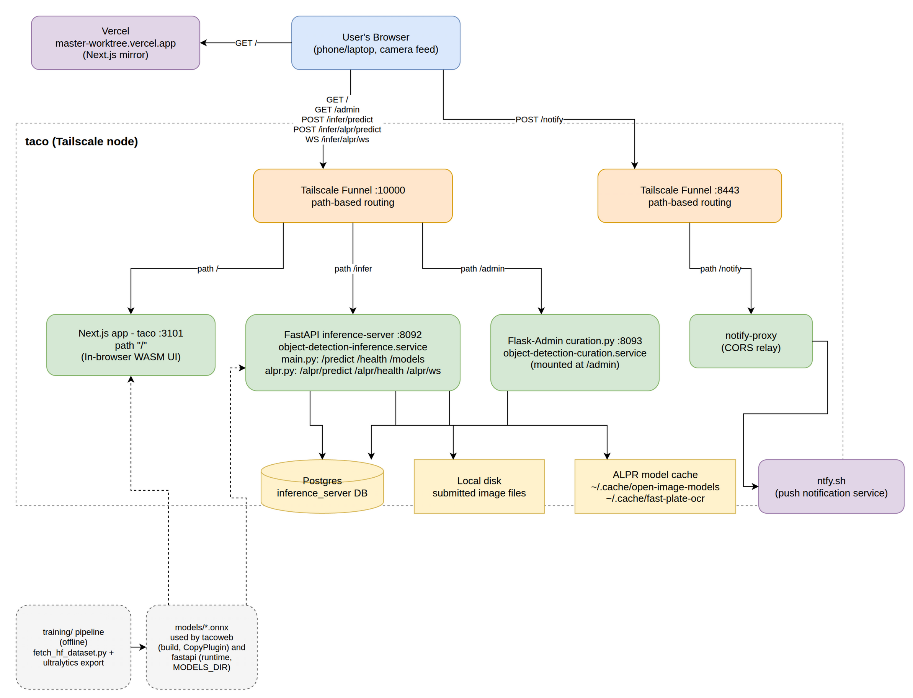
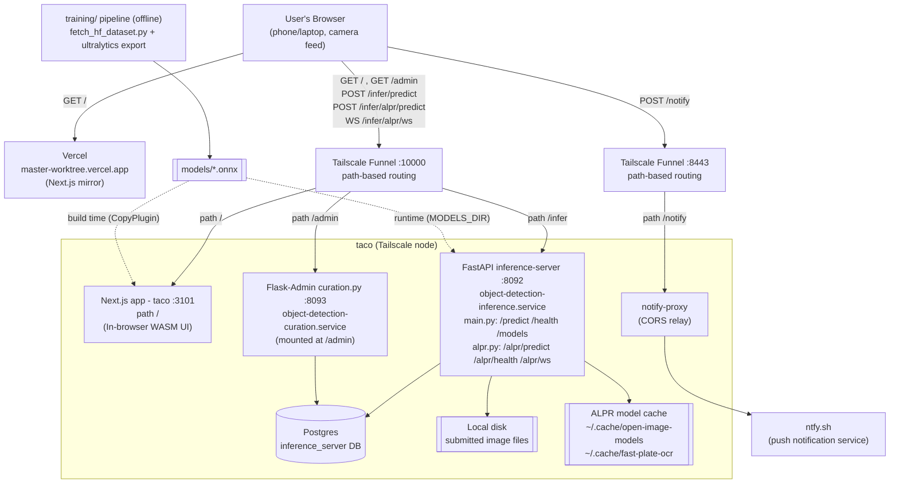

# System architecture

How the pieces in this repo talk to each other over the network: the two
frontend hosts, taco's Tailscale Funnel path routing, the FastAPI/Flask-Admin
services behind it, and the offline training pipeline that feeds `models/`.
See [`realtime-object-detection.md`](./realtime-object-detection.md) for the
end-user view and [`user-manual.md`](./user-manual.md) for the API/curation
reference — this doc is just the network-level map tying them together.

## Diagram

The PNG above has the diagram embedded in it (exported with draw.io's
"include a copy of my diagram" option) — open it directly in
[diagrams.net](https://app.diagrams.net/) (File > Open From > Device) to
edit it, no separate source file needed. The equivalent source also lives
alongside it as plain files if you'd rather edit those directly:

- [`diagrams/system-architecture.drawio`](./diagrams/system-architecture.drawio)
  — same diagram as draw.io XML.
- [`diagrams/system-architecture.mmd`](./diagrams/system-architecture.mmd)
  — the same layout as a Mermaid flowchart (renders natively below, and on
  GitHub):

## Notes

- **Two frontend hosts, same code**: `taco :10000` (path `/`) is the
  self-hosted, no-usage-limit deployment; the Vercel mirror is a convenience
  alternative. Both serve the same Next.js app, including the local-WASM,
  server-side, and ALPR detection modes described in
  [`realtime-object-detection.md`](./realtime-object-detection.md).
- **Two Tailscale Funnel ports on taco**: `:10000` path-routes `/`, `/infer`,
  and `/admin` to the three services this repo owns; `:8443` carries
  `notify-proxy` (and other unrelated services sharing that port, per
  CLAUDE.md — Tailscale Funnel only exposes a handful of public ports, so
  services share them via path routing rather than each claiming a new one).
- **Everything persisted goes through `inference-server/persist.py`**:
  `main.py`'s `/predict` and `alpr.py`'s `/alpr/*` both write to the same
  Postgres `inference_server` DB and local disk, which is what `/admin`
  browses/curates.
- **`models/*.onnx` has two independent consumers**: bundled into the
  Next.js build via webpack's `CopyPlugin` (for the in-browser WASM path),
  and loaded directly off disk by the FastAPI server (`MODELS_DIR`) for the
  server-side path — see CLAUDE.md's "Adding a custom model" for how a new
  model file reaches both.
